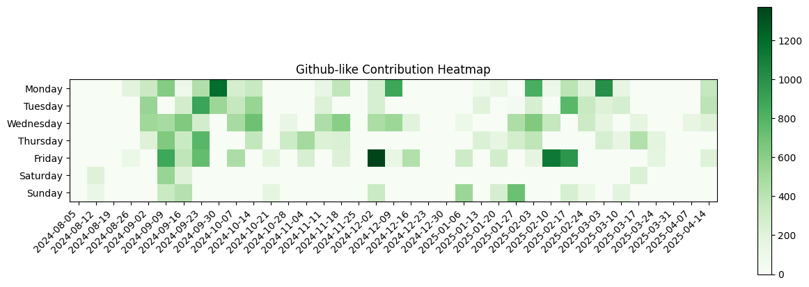

```
20240817 102.41 (6.28-0.59)*18   103.86 (5.86-1.14)*22
20240818 120.37 (6.65-0.63)*20
20240826 178.97 (6.29-1.03)*34
20240830 108.75 (5.60-1.25)*25
20240902 221.35 (6.97-0.65)*35   98.37 (5.14-1.63)*28
20240903 231.28 (6.97-0.72)*37   195.94 (6.50-1.06)*36   124.42 (5.24-1.58)*34
20240904 232.86 (6.43-1.14)*44   120.20 (6.52-0.80)*21   168.89 (4.70-1.11)*47
20240905 212.03 (6.70-0.97)*37
20240909 184.72 (6.27-1.28)*37   437.19 (6.97-0.81)*71
20240911 183.43 (6.90-0.57)*29   117.59 (6.94-0.41)*18   181.94 (6.26-1.06)*35
20240912 221.05 (6.76-0.95)*38   182.21 (6.87-0.79)*30   237.13 (6.95-0.87)*39
20240913 218.14 (6.92-0.86)*36   199.45 (6.78-0.55)*32   238.49 (7.14-0.51)*36   221.87 (6.67-1.13)*40
20240914 268.40 (7.15-0.60)*41   278.18 (7.00-0.82)*45
20240915 43.38 (6.44-1.62)*9   288.20 (7.07-0.80)*46
20240916 88.33 (7.46-0.67)*13
20240917 276.98 (5.79-1.02)*58
20240918 202.73 (6.61-1.27)*38   296.21 (6.84-0.79)*49   141.08 (6.35-0.92)*26
20240919 263.38 (6.74-0.62)*43   61.42 (6.31-1.58)*13
20240920 266.91 (6.77-1.09)*47   108.74 (6.70-1.26)*20
20240921 207.81 (6.66-1.19)*38
20240922 209.09 (7.06-0.91)*34   218.21 (7.21-0.79)*34
20240923 136.14 (6.78-0.86)*23   310.43 (7.17-0.57)*47
20240924 379.35 (7.19-0.65)*58   267.50 (7.36-0.50)*39   243.93 (6.74-1.07)*43
20240925 143.38 (7.14-0.62)*22   135.47 (5.90-1.53)*31
20240926 208.60 (7.13-0.40)*31   192.48 (7.39-0.52)*28   176.97 (6.93-1.03)*30   201.06 (6.85-0.94)*34
20240927 149.04 (6.29-0.96)*28   176.15 (7.37-0.85)*27   183.43 (6.90-0.57)*29   225.56 (7.27-0.44)*33
20240930 175.40 (7.35-0.60)*26   208.53 (7.19-0.47)*31   172.90 (6.87-1.10)*30   218.19 (6.55-0.81)*38   405.44 (7.10-0.56)*62
20241001 270.24 (7.19-0.76)*42   256.34 (7.23-0.66)*39
20241007 267.33 (6.75-0.67)*44
20241008 149.36 (7.13-0.64)*23   193.91 (6.47-1.09)*36
20241009 238.24 (7.03-0.76)*38   245.32 (6.97-0.68)*39
20241011 269.05 (7.21-0.95)*43   193.92 (6.32-1.08)*37
20241014 333.77 (5.15-1.23)*85
```
